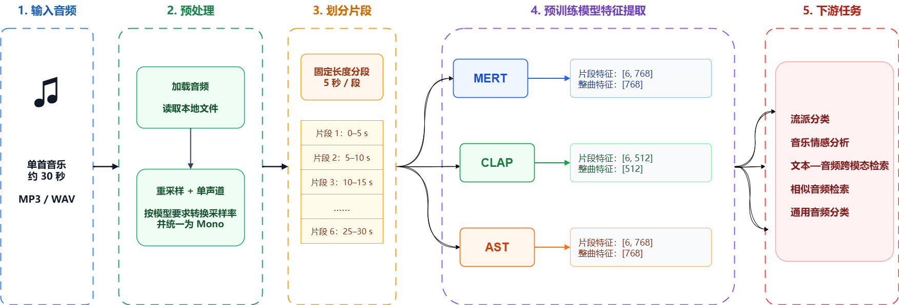
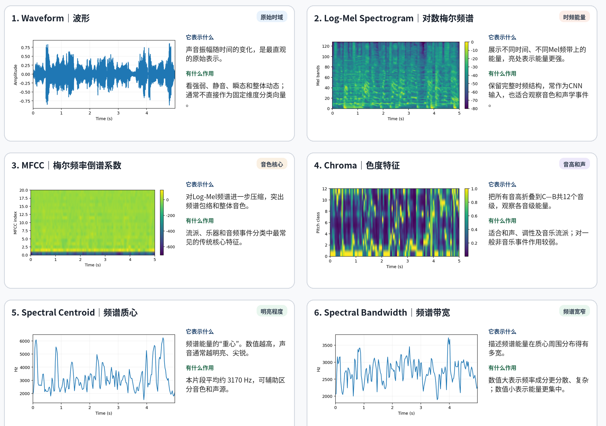
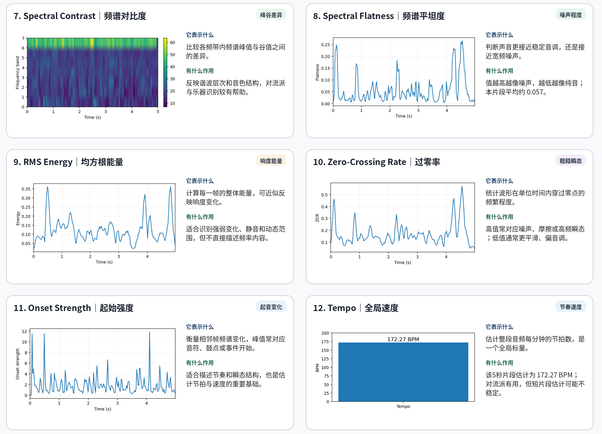

# Blog

`Blog` 是CSDN博客源码库，目前包含两篇博客的源码：

- `pretrained_embeddings`：使用 MERT、CLAP、AST 等预训练模型提取音频 embedding；
- `traditional_feature`：使用传统音频分析方法提取并可视化特征。

## 功能概览

### `pretrained_embeddings`

- 从 `configs/config.yaml` 读取音频路径、切片长度、设备和模型配置；
- 将音频按固定时长切片；
- 依次运行 MERT、CLAP、AST；
- 对片段特征做汇总，保存歌曲级 embedding；

### `traditional_feature`

- 加载本地音频 `data/000002.mp3`；
- 按 5 秒切片；
- 提取 waveform、log-mel、MFCC、chroma、谱质心、带宽、对比度、平坦度、RMS、ZCR、onset、tempo 等特征；
- 绘制特征可视化面板；


## 目录结构

```text
Blog/
├── assets/                     # 项目图片
├── data/                       # 本地音频数据
├── pretrained_embeddings/      # 预训练特征提取项目
│   ├── configs/config.yaml     # 运行配置
│   └── src/                    # 代码
├── traditional_feature/        # 传统特征提取项目
│   └── src/                    # 代码
└── requirements.txt            # 统一依赖
```

## 博客插图

### 预训练特征提取流程



### 传统特征提取流程 - 上



### 传统特征提取流程 - 下




## 配置

```powershell
cd D:\MyProject\Blog
conda create -n blog python=3.12
conda activate blog
pip install -r requirements.txt
```
